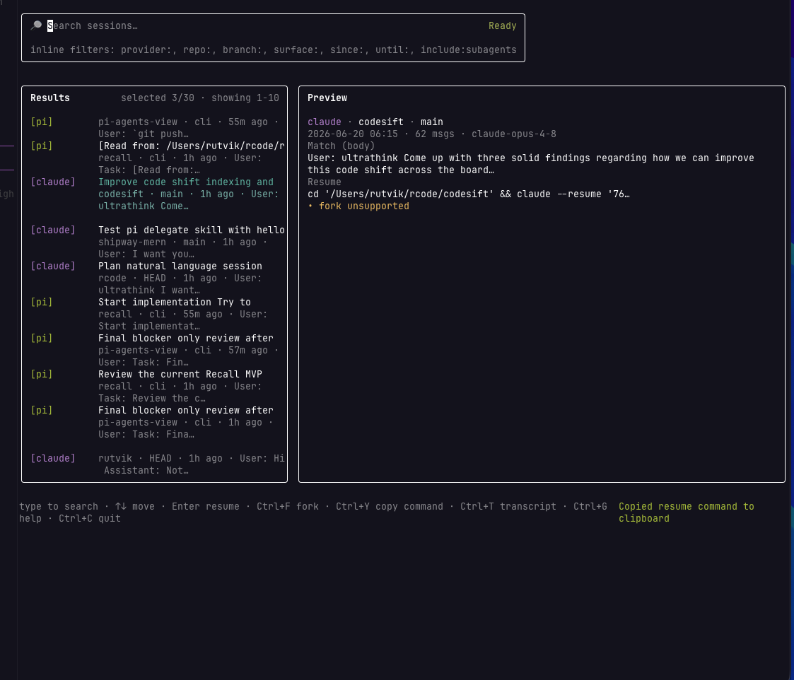

# recall

Search every agent session — Claude, Codex, pi — in plain English. Jump back in with the exact resume command.



## Install

```bash
npm install -g coding-agent-recall
```

Or without installing globally:

```bash
npx coding-agent-recall
```

## Enable semantic search (optional)

**Local** — offline, ~300MB model downloaded once:

```bash
recall setup
```

**Cloud** — more accurate, needs a Voyage API key:

```bash
export VOYAGE_API_KEY=your_key
```

Fast keyword search works out of the box — skip this if that's enough.

## Go

```bash
recall sync   # index your sessions
recall        # search
```

That's it.

---

Trouble? Run `recall doctor`. Full rebuild after switching providers: `recall index --full`.

For more detail: [`PRD.md`](./PRD.md) · [`IMPLEMENTATION.md`](./IMPLEMENTATION.md)
